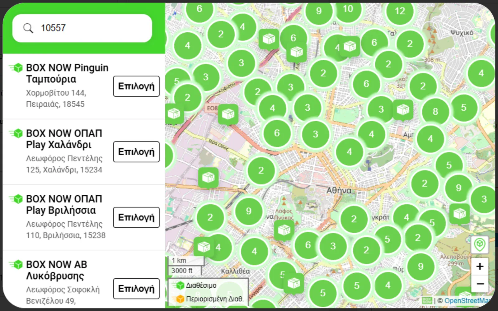

# BOX NOW Delivery for WooCommerce


Open source WooCommerce integration for [BOX NOW](https://boxnow.gr) parcel lockers.



## Why this exists

The official BOX NOW plugin works, and it is HPOS compatible. This one exists for
feature parity with [wc-acs-courier](https://github.com/jimrarras/wc-acs-courier)
and for ownership of the code: it is class-based, unit-tested, and fixes ten
defects found in the official plugin (3.3.1).

Notable fixes:

- Per-parcel compartment sizing. Upstream declared every parcel at the first
  item's size.
- Per-parcel value and weight. Upstream repeated the whole order's totals on
  each parcel, so a 3-parcel order declared 3x the real weight.
- Token caching. Upstream re-authenticated on every API call despite a 1-hour token.
- Deterministic order numbers, so a retried request can be deduplicated.
- Country-aware phone prefixes for Bulgaria, Croatia and Slovenia.

## Features

- Locker selection at checkout, on both the classic and Blocks checkout
- Server-side locker validation, so express checkout (Apple Pay, Google Pay, PayPal) cannot bypass it
- Voucher creation, printing, tracking and cancellation from the order screen
- Automatic voucher creation on any order status you choose
- Automatic shipment tracking with "Delivered (BOX NOW)", "Returned (BOX NOW)" and "Needs Attention (BOX NOW)" order statuses
- Orders BOX NOW cannot resolve on its own (a lost or cancelled parcel) settle to "Needs Attention" instead of being polled indefinitely
- Tracking links in customer emails, an optional standalone BOX NOW tracking email on voucher creation, plus a [boxnow_tracking] shortcode
- Optional inbound webhook for near-real-time tracking
- Optional: hide cash on delivery while BOX NOW is the chosen shipping method
- Runs next to ACS Courier and Geniki Taxydromiki on the same store, each plugin shipping only its own orders (see [Running next to ACS Courier and Geniki Taxydromiki](#running-next-to-acs-courier-and-geniki-taxydromiki))
- Greece, Bulgaria, Croatia, Slovenia and Cyprus

Requires BOX NOW API credentials. Contact BOX NOW to obtain them.

## Requirements

- WordPress 6.2+, WooCommerce 8.0+, PHP 7.4+
- BOX NOW API credentials (client id, client secret, partner id)

## Installation

1. Upload the `wc-boxnow-delivery` folder to `/wp-content/plugins/`
2. Activate the plugin
3. Go to WooCommerce → BOX NOW Delivery and enter your credentials
4. Add "BOX NOW Delivery" as a shipping method in WooCommerce → Settings → Shipping

## Configuration

Credentials, the API environment, automation and display options live under WooCommerce → BOX NOW Delivery. The two options below need a little more explanation.

### Locker widget

The widget display mode setting offers `popup` (a button opens BOX NOW's map in an
overlay) and `embedded` (the map is shown inline beneath the BOX NOW shipping
rate). Both work on the classic and the Blocks checkout, and both keep the
`[boxnow_map_iframe]` shortcode available for embedding the map elsewhere.

BOX NOW lockers accept card payment on collection, so cash on delivery stays
available by default. The setting "Disable Cash On Delivery For BOX NOW" hides the
COD gateway while BOX NOW is the chosen rate and rejects it server-side on both
checkouts. On the pay-for-order page the order being paid decides, not the cart:
a BOX NOW order is offered no COD even when the cart is empty, and another
carrier's order keeps COD while the cart is on BOX NOW. The setting only ever
removes COD, so another plugin's own COD rule still applies.

### Tracking emails

Two independent options, both off by default:

- **Tracking in customer emails** (plugin settings) appends a BOX NOW tracking
  block to WooCommerce's own customer order emails.
- **BOX NOW tracking** (WooCommerce, Settings, Emails) is a standalone email sent
  to the customer when vouchers are created, with a tracking link per parcel.
  Subject, heading and extra text are editable there, and the templates in
  `templates/emails/` can be overridden from the theme like any WooCommerce email.

## Running next to ACS Courier and Geniki Taxydromiki

This plugin runs on stores that also use
[ACS Courier](https://github.com/jimrarras/wc-acs-courier) (tested with 1.3.1) and
[Geniki Taxydromiki](https://github.com/jimrarras/wc-geniki-taxydromiki). Each
plugin ships only its own orders. For BOX NOW that means an order with a BOX NOW
Delivery (`box_now_delivery`) shipping line, plus any order that still has live
BOX NOW parcels (see [Vouchers](#vouchers)). Everything below also works with
only one of the other two plugins active, and with neither. Use BOX NOW 1.0.6
together with Geniki Taxydromiki 1.0.1: each plugin keeps its own orders out of
ACS Courier's bulk action, so an older Geniki leaves Geniki orders exposed, and
an older BOX NOW leaves BOX NOW orders exposed.

### Vouchers

**BOX NOW's own vouchers**

- Automatic creation (Auto-create Vouchers On Status) and the bulk action "Create
  BOX NOW vouchers" only act on orders with a BOX NOW shipping line and no BOX NOW
  parcels yet. They skip an order, with an order note, when it:
  - already has an ACS Courier (`_acs_voucher_no`) or Geniki Taxydromiki
    (`_geniki_voucher_no`) voucher that can still carry the order. A voucher
    that carrier's tracking reports back at the store (ACS `denied` in
    `_acs_tracking_final`, Geniki `returned` or `cancelled` in
    `_geniki_tracking_final`) does not count, so a BOX NOW reship goes
    through; or
  - also has a shipping line other than BOX NOW (a split order). A BOX NOW
    voucher declares the whole order and, for cash on delivery, collects the
    whole order total.
- The bulk action reports its result once: the number of vouchers created, and a
  warning with the number of orders skipped (not a BOX NOW order, already has a
  voucher, split, or creation failed). Split orders, orders with another
  carrier's voucher and failed creations also get an order note, and the warning
  says how many of the skipped orders have one. Orders that are not BOX NOW's,
  or already have BOX NOW parcels, are skipped without a note.
- Create Voucher in the BOX NOW box on the order is the deliberate override. It
  asks for confirmation when another carrier's voucher exists, and the box warns
  on a split order. It never blocks.
- BOX NOW never books a voucher on a Geniki Taxydromiki order or changes its
  status. Geniki guards its own orders.

**ACS Courier's vouchers**

- A BOX NOW parcel counts as live until it is cancelled, or until BOX NOW
  tracking (polling or the webhook) reports it returned, lost or cancelled. A
  parcel that tracking reports delivered, or that it has no status for (tracking
  off, or a second batch booked after the order settled), stays live. The veto,
  the bulk exclusion and the confirmation below count live parcels only.
- ACS Courier's automatic vouchers already skip orders with a BOX NOW shipping
  line (ACS Courier 1.0.1 or later). BOX NOW also vetoes them, through ACS's
  `wc_acs_auto_create_voucher_allowed` filter, on an order that still has live
  BOX NOW parcels after its shipping line was changed away from BOX NOW, and adds
  an order note listing those parcel ids. The veto lifts once no parcel is live:
  cancel the parcels in the BOX NOW box while BOX NOW still allows it (status
  new), or let tracking record that BOX NOW returned, lost or cancelled them. A
  parcel BOX NOW has already accepted cannot be cancelled. For a delivered
  parcel, or with tracking off, use Create Voucher in the ACS box.
- ACS Courier's bulk action "ACS: Create Vouchers" leaves out every BOX NOW order
  and every order with live BOX NOW parcels. This works on the HPOS and the
  legacy orders screen without any change to ACS Courier (checked against 1.3.0
  and 1.3.1). A one-time notice lists the order numbers left out. When every
  selected order is left out, ACS runs nothing, and its result notice from an
  earlier run on the same list is not shown again. ACS's other bulk actions, such
  as printing, still get the whole selection.
- ACS Courier shows its bulk result ("N ACS vouchers created.") whenever its
  query arg is in the orders list URL, and WooCommerce builds each bulk redirect
  from that URL. BOX NOW removes ACS's and Geniki Taxydromiki's result args only
  from the redirect of its own bulk action, and from the one above where every
  selected order is left out. So ACS's notice can still show again after a
  WooCommerce status or trash bulk action, or after ACS's next bulk action (Print
  after Create). Nothing is booked again; only ACS Courier can close this.
- To ship one of those orders with ACS on purpose, use Create Voucher in the ACS
  box on the order. On a BOX NOW order, or one with live BOX NOW parcels, it asks
  for confirmation first (a browser dialog with text from the BOX NOW box). When
  Geniki Taxydromiki also claims the order, only one question appears, and it
  carries both plugins' texts, whichever plugin asks it. Cancel stops ACS's
  request; nothing is blocked on the server. Cancelling a single BOX NOW parcel
  reloads the order screen, as Cancel All does, so the question and the
  warnings follow the parcels that are left.

### Orders moved off BOX NOW

When staff change an order's shipping line from BOX NOW to another method after
its parcel was booked:

- The BOX NOW box keeps listing the parcels with Print, Track and Cancel. While a
  parcel is live, a warning asks to cancel it unless it will still go with BOX
  NOW. The locker field and Create Voucher stay tied to a BOX NOW shipping line.
- Once the parcels reach a final status, tracking (polling and webhook) records
  BOX NOW's outcome in an order note and stops polling, but leaves the order
  status alone: it belongs to the carrier that now ships the order. ACS Courier's
  tracking, for one, only follows orders in processing, on-hold or completed.
- Customer emails leave out the BOX NOW tracking block.
- An order with no shipping line at all behaves as before.

To waive the shipping fee on an order that still ships with BOX NOW, change the
cost on the BOX NOW line instead of switching the method. A store that switches
the method anyway can bring the status change back:

```php
add_filter( 'wc_boxnow_settle_order_without_boxnow_line', '__return_true' );
```

### Tracking and the webhook

- Polling and the webhook follow the same order statuses: processing, on-hold and
  completed (filter `wc_boxnow_tracked_order_statuses`).
- A webhook event for a parcel on an order in any other status (cancelled,
  refunded, failed, or settled by another carrier, such as `acs-delivered` or
  `geniki-returned`) answers 200 with `{"ok":true,"applied":false}`. It records
  the parcel's status, adds one order note per status change and leaves the order
  status unchanged. Before 1.0.6 a final parcel status moved such an order to a
  BOX NOW status.
- An order BOX NOW already settled is left alone without a note, as before,
  whatever its status now (for example refunded after delivery): the webhook
  records the parcel status and answers `{"ok":true}`.
- A store whose orders wait in a custom status while the BOX NOW parcel travels
  (for example the status automatic vouchers are created at) must add it, or
  neither polling nor the webhook moves those orders:

```php
add_filter( 'wc_boxnow_tracked_order_statuses', function ( $statuses ) {
    $statuses[] = 'ready-to-ship'; // Without the wc- prefix.
    return $statuses;
} );
```

### Reshipping after a failed delivery

ACS Courier's and BOX NOW's tracking only follow orders in processing, on-hold
or completed. After a failure status, such as Needs Attention (BOX NOW),
Returned (BOX NOW), Delivery Denied (ACS) or Returned (Geniki), create the new
voucher, then move the order back to Processing so the reship is tracked.
WooCommerce sends the customer no email for that change. As before, BOX NOW does
not track a second BOX NOW batch on an order BOX NOW itself already settled.

To reship with ACS Courier after BOX NOW returned, lost or cancelled the parcel,
you can also change the shipping line to ACS Courier and move the order into
the status ACS creates vouchers at (for example Processing, from another
status). Once tracking has recorded that final parcel status, ACS's automatic
voucher and its bulk action include the order again. While the BOX NOW shipping
line stays on the order, ACS automation and bulk still skip it. Without a
recorded status (tracking off), or for a delivered parcel, use Create Voucher in
the ACS box.

### Checkout

- **The chosen rate is kept.** WooCommerce resets the chosen rate to its default
  (the first rate) whenever the list of rates changes, even when the chosen rate
  is still offered. ACS Courier's "exclusive" cash on delivery mode for ACS Point
  withdraws that rate when cash on delivery is clicked, which moved a BOX NOW
  customer to the first rate, or moved a customer on another carrier to BOX NOW
  when BOX NOW was listed first. BOX NOW now keeps the chosen rate while it is
  offered and either it or WooCommerce's default is BOX NOW
  (`woocommerce_shipping_chosen_method`, priority 20). A free-shipping coupon
  still switches to free shipping, as WooCommerce does. Crossing a free-shipping
  minimum without a coupon no longer moves a BOX NOW customer (chosen, or
  preselected as the first rate) to a free-shipping rate listed first: free
  shipping is offered, and the customer picks it. The BOX NOW method's own
  free delivery threshold still makes BOX NOW free, because it only changes the
  cost of the same rate; set it to the same amount if BOX NOW should be free
  there too. On a store with ACS
  Courier, prefer the ACS Point setting "Never at any ACS Point" to "exclusive":
  it keeps the rate list the same when the payment method changes.
- **Changed rates are caught.** If WooCommerce still replaces the rate the
  customer saw, and BOX NOW is on either side, the classic checkout refuses the
  order with "Your shipping method was updated. Please review your order and
  place it again." and refreshes. Placing the order again goes through.
- **The locker survives payment clicks.** Geniki Taxydromiki refreshes the
  classic checkout when the payment method changes. A refresh that started
  before a locker pick was saved could bring back the previous locker. Every
  refresh now stores the locker shown in the picker. A cart split into several
  shipping packages shows one picker per package that offers BOX NOW; a pick is
  written into all of them.
- **Leftover ACS Points are removed.** ACS Courier prints an order's ACS Point in
  the order emails. When a failed ACS Points payment is placed again with BOX
  NOW, or staff switch the line, that point stayed on the order. BOX NOW removes
  the `_acs_point_*` meta at checkout (classic and Blocks) and when staff set a
  locker in the BOX NOW box, where an order note records it. The point is kept
  while the order still has an ACS Points line or an ACS voucher.
- **One picker at a time.** The BOX NOW picker does not open while the ACS Points
  or Geniki Taxydromiki map is open, and the back button closes only the picker
  on top.
- **Keyboard focus.** On phones, focus moves to the sheet's close button when the
  picker opens. Closing it returns focus to "Pick a Locker", and so does the
  checkout refresh after a locker is chosen, unless that refresh failed or the
  customer has moved on to another field or button meanwhile.
- **Pay-for-order page.** "Disable Cash On Delivery For BOX NOW" follows the
  order being paid there, not the cart (see [Locker widget](#locker-widget)).
  ACS Courier's own COD rule for ACS Points still reads the cart on that page.

### Filters

All four are new in 1.0.6.

| Filter | Default | Use |
|---|---|---|
| `wc_boxnow_tracked_order_statuses` | `array( 'processing', 'on-hold', 'completed' )` | Order statuses, without `wc-`, that polling and the webhook may move an order out of |
| `wc_boxnow_settle_order_without_boxnow_line` | `false` | Arguments `$settle`, `$order`, `$order_status`. Return true to let tracking set the BOX NOW status on an order whose shipping line is no longer BOX NOW |
| `wc_boxnow_other_carrier_voucher_keys` | `array( '_acs_voucher_no' => 'ACS Courier', '_geniki_voucher_no' => 'Geniki Taxydromiki' )` | Order meta keys, each mapped to a carrier name, that mark another carrier's voucher. Automatic and bulk creation skip such an order, and the Create button asks first |
| `wc_boxnow_foreign_bulk_result_args` | ACS Courier's `acs_vouchers_created`, `acs_vouchers_printed`, `acs_print_error`, `acs_no_vouchers` and Geniki Taxydromiki's `geniki_vouchers_created`, `geniki_print_error`, `geniki_vouchers_printed` | Query args removed from the redirect of BOX NOW's own bulk action, so another plugin's old result notice does not show again |

## Reference

### Order statuses

Tracking settles an order to one of three plugin statuses: Delivered (BOX NOW),
Returned (BOX NOW), or Needs Attention (BOX NOW) for a parcel BOX NOW reports as
lost or canceled. A delivered parcel does not pass through WooCommerce's own
`completed`, so the "completed" customer email does not fire and download
permissions are not granted. That is the right default for physical goods. A
store that also sells downloadable products can opt in to routing through
`completed`:

```php
add_filter( 'wc_boxnow_settled_order_status', function ( $status, $order ) {
    return 'boxnow-delivered' === $status ? 'completed' : $status;
}, 10, 2 );
```

The plugin still records what BOX NOW reported on the order, so a filtered order
settles once and is not polled again.

Tracking only moves an order out of processing, on-hold or completed
(`wc_boxnow_tracked_order_statuses`), and leaves the status of an order whose
shipping line is no longer BOX NOW alone. See
[Running next to ACS Courier and Geniki Taxydromiki](#running-next-to-acs-courier-and-geniki-taxydromiki).

### Privacy and third-party requests

The plugin's own scripts talk only to the store (`admin-ajax.php`) and render
plain links to `https://t.boxnow.gr/?track=...`. The locker map is BOX NOW's
hosted widget in an iframe, loaded only when the customer opens it (popup mode) or
has selected BOX NOW as the shipping method (embedded mode), never while the rate
is merely offered. Inspected on 2026-09-05 against `widget-v5.boxnow.gr`, the
widget itself loads from:

| Host | Purpose |
|---|---|
| `widget-v5.boxnow.{gr,bg,hr,si,cy}` | The widget; sits behind a Cloudflare bot challenge, which may set Cloudflare's `__cf_bm` / `_cfuvid` cookies on that origin |
| `globallockersprod.z28.web.core.windows.net` | Locker positions (Azure static storage) |
| `tile.openstreetmap.org` | Map tiles (Leaflet) |
| `geocode-api.arcgis.com` | Address search and suggestions, on typing |
| `api.ipstack.com` | IP-based location when GPS is unavailable or denied |
| `unpkg.com`, `cdnjs.cloudflare.com`, `ajax.googleapis.com` | Leaflet, marker clustering, jQuery |
| `fonts.googleapis.com`, `fonts.gstatic.com` | Roboto |

With GPS Permission set to `on` the widget asks the browser for geolocation. It
uses `localStorage` inside its own origin and set no readable first-party cookies
during inspection. A store with a consent banner should list these hosts in its
cookie policy and treat the widget as strictly necessary only once BOX NOW is the
chosen delivery method.

## Development and tests

```bash
composer install
vendor/bin/phpunit -c phpunit.xml               # unit
cp .env.example .env                            # add staging credentials
vendor/bin/phpunit -c phpunit-integration.xml   # integration
./build.sh                                      # release zip
```

Translations are maintained by hand with two small dev scripts (not included in the release zip):
- `php bin/make-pot.php` scans the plugin source for translatable strings and writes `languages/wc-boxnow-delivery.pot`
- `php bin/make-mo.php languages/wc-boxnow-delivery-el.po` compiles the Greek catalogue into its `.mo`

Integration tests skip cleanly when `.env` is absent. Tests that would create
real staging parcels additionally require `BOXNOW_ALLOW_WRITE_TESTS=1`.

Manual verification on a real store follows `docs/testing-checklist-ui.md` (no
credentials needed) and `docs/testing-checklist-integration.md` (staging
credentials, real BOX NOW calls). Open items are tracked in `docs/KNOWN-ISSUES.md`.

Issues and pull requests are welcome. Report security problems privately, as described in [SECURITY.md](SECURITY.md).

## Credits

Built on the BOX NOW Partner API and BOX NOW's hosted locker widget. BOX NOW is a trademark of its owner. This plugin is not affiliated with or endorsed by BOX NOW.

## Support

If this plugin saves you time, you can buy me a coffee.

<a href="https://buymeacoffee.com/jimrarras"></a>

## License

GPL-2.0-or-later. See [LICENSE](LICENSE).
